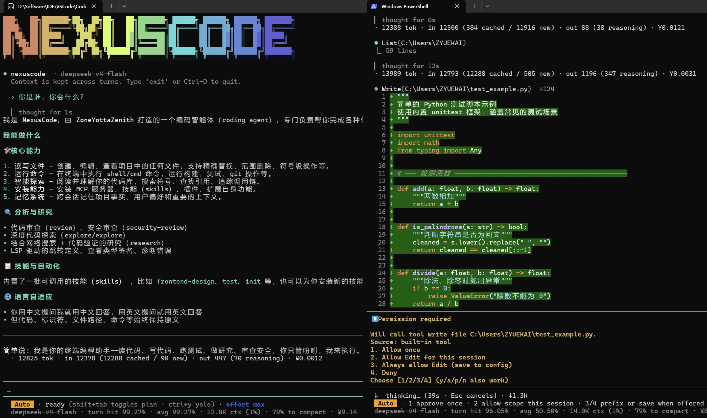
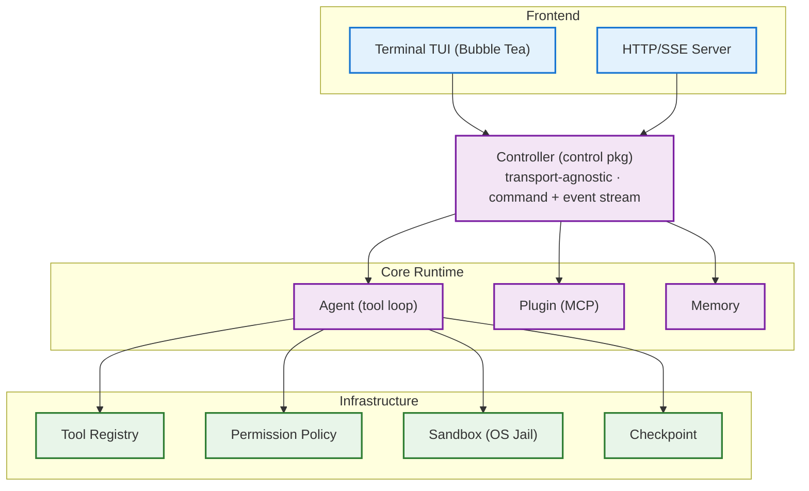

<p align="center">
  <a href="./README.md">📄 简体中文</a>
  &nbsp;·&nbsp;
  <strong>📄 English</strong>
</p>

<br/>

<p align="center">
  
</p>

<br/>

<h3 align="center">CLI Vibe Coding Agent · AI Programming Agent</h3>
<p align="center">Single binary · Declarative config · MCP plugin system · Cache depth optimization<br/>A plug-and-play DeepSeek Vibe Coding Agent for your terminal.</p>

---

## Overview

NexusCode is a terminal-based coding agent designed with an agent-first architecture. It is not a script that calls an LLM API—it is a complete agent runtime: a transport-agnostic session driver, a composable tool abstraction, defense-in-depth security, cache-aware context management, a core agent orchestration harness, and a full MCP protocol implementation.

Core design principles:

- **Transport-agnostic**: A single Controller drives multiple frontends (TUI / HTTP-SSE). Each frontend only issues commands and renders events.
- **Interface segregation**: Tools, permissions, memory, and sandbox are composed through interface contracts, self-registering at runtime.
- **Cache-first**: Designed around DeepSeek's automatic prefix cache—the system prompt stays byte-identical across turns.

## Architecture



## Technical Highlights

### Cache-Aware Context Management

Managing the LLM context window is the core constraint of agent system design. NexusCode is specifically optimized around DeepSeek's automatic prefix caching:

- **Byte-stable system prompt**: The base prompt, tool schemas, and loaded memory remain byte-identical throughout a session, maximizing prefix cache hit rate
- **Append-first**: Most turns append to the message tail without modifying the prefix—the cache stays warm
- **Three-level compaction**:
  | Level | Trigger | Behavior |
  |-------|---------|----------|
  | snip | `toolResultSnipRatio` (0.6) | Rewrite/truncate stale tool output, preserve conversation structure and cache prefix |
  | prune | `compactRatio` (0.8) | Remove non-critical assistant/tool message pairs |
  | compact | `compactForceRatio` (0.9) | Call a secondary LLM to summarize early conversation into a structured briefing, keep user turns verbatim |
- **Archive safety**: Pre-compaction messages are serialized to `<config>/archive/`—no information loss

The three levels with configurable soft/hard thresholds allow long-running sessions on large context windows without triggering full compaction.

### Defense-in-Depth Security

Security is layered into three independent, individually testable tiers:

```
┌──────────────┐
│  Permission  │  ← pure-function rule evaluation: allow / ask / deny
│  Policy      │     supports exact paths, globs, bash command decomposition
├──────────────┤
│  Gate        │  ← wraps Policy with optional interactive Approver
│              │     three modes: ask (default), auto, yolo
├──────────────┤
│  Sandbox     │  ← OS-level execution jail:
│              │     macOS   → Seatbelt (sandbox-exec)
│              │     Linux   → bubblewrap
│              │     Windows → AppContainer (read-only) /
│              │                low-integrity token (write) + Job Object
└──────────────┘
```

The sandbox enforces actual OS-level jailing—even permitted commands cannot escape. Windows uses a dedicated native helper binary for sandboxing.

### Security Review & Evidence System

NexusCode includes a dedicated **Guardian security sub-agent**. Before every tool call, Guardian (using its own model and read-only tools) evaluates the operation's risk level in real-time and provides an approval recommendation. A built-in circuit breaker halts execution after 3 consecutive rejections.

After each task step, the agent must provide **proof of execution** via the `complete_step` tool—command verification, file diffs, file manifests, or manual confirmation. Completions without evidence are rejected. The final answer also passes through a Readiness Audit gate: unfinished todos, missing checks, and command mismatches all block submission.

### Tool Abstraction Design

The `tool.Tool` interface is the system's core abstraction:

```go
type Tool interface {
    Name() string
    Description() string
    Schema() json.RawMessage      // JSON Schema parameter definition
    Execute(ctx, args) (string, error)
    ReadOnly() bool               // read/write distinction for parallel batching
}
```

Extension mechanisms use interface type assertions:

- **`Previewer`**: Writer tools implementing this interface can provide operation previews (affected files, diff content) for approval card rendering and checkpoint snapshot triggering
- **`PlanModeClassifier`**: Tools declare whether they are safe during planning mode—plan mode defaults to fail-closed

Built-in tools self-register at compile time via `init()`. MCP plugin tools are adapted to the same `Tool` interface at runtime—the agent sees a unified `*Registry` with no distinction between built-in and plugin tools.

### Checkpoints (Edit Safety Net)

A git-free snapshot-based safety net. Before every writer tool executes, the agent records the file's pre-edit state:

```go
type Checkpoint struct {
    Turn     int         // user turn index
    MsgIndex int         // message index for conversation rewind
    Files    []FileSnap  // affected file snapshots
}
```

- Each turn stored as an independent JSON file for corruption isolation
- Supports code rewind + conversation rewind (fork both together)
- Persisted across sessions, available after restart
- Only tracks Previewable write operations; bash and other unpredictable operations are excluded by design
- Supports session branching (`/branch`): fork code and conversation together from any historical turn

### LSP Code Intelligence

Built-in Language Server Protocol manager supporting Go, TypeScript, Rust, Python, and more. Lazily initialized per session, exposing four code intelligence tools:

- `lsp_definition` — navigate to symbol definitions
- `lsp_diagnostics` — retrieve file diagnostics and errors
- `lsp_hover` — inspect symbol types and documentation
- `lsp_references` — find all references

A Tree-sitter-based code symbol index (`code_index`) is also included, providing file outlines and symbol candidates without requiring an external LSP—enabling code understanding in offline or lightweight scenarios.

### MCP Protocol Implementation

Full Model Context Protocol implementation (JSON-RPC 2.0) with three transport strategies:

| Transport | Use Case | Implementation |
|-----------|----------|----------------|
| stdio | Local subprocess | `exec.Command`, stdin/stdout JSON-RPC |
| Streamable HTTP | Remote endpoint | HTTP POST with streaming response support |
| Legacy HTTP+SSE | Compatibility | SSE initialization + HTTP calls |

Plugin call timeout, resource management, and reconnection are handled by the unified `plugin` package.

### Plugin Packages & Ecosystem

Beyond MCP, NexusCode supports a **plugin package system**. A plugin package bundles skills, lifecycle hooks, and MCP server configurations into a single installable unit from a GitHub repository:

```sh
nexuscode plugin install <github-repo>
```

Supports branch pinning, local directory install, and dry-run preview. Full management suite: `plugin list/show/remove/enable/disable/doctor`.

**Lifecycle Hooks**: Events like `PreToolUse`, `PostToolUse`, `PermissionRequest`, `UserPromptSubmit`, and `Stop` can trigger local shell commands (exit code 2 intercepts the operation), enabling custom workflow automation. Project-level hooks require `hooks trust` authorization.

### Memory System

Hierarchical memory architecture:

```
Project-level: .nexuscode/NEXUSCODE.md
User-level:    ~/.config/nexuscode/NEXUSCODE.md
Global:        ~/.nexuscode/NEXUSCODE.md
Auto-memory:   BM25 retrieval + Memory Compiler v5 fact extraction
Quick-add:     #<note> inline addition
```

Memory is loaded once at session startup and injected into the system prompt. The prefix is never modified mid-session to preserve cache warmth.

### Three Collaboration Modes

NexusCode offers three progressive collaboration modes:

- **Plan Mode**: The agent first researches the codebase with read-only tools, analyzes dependencies, and produces a plan—then executes after confirmation. Both models run in independent sessions to keep their prompt prefix caches stable. The planner can request approval via `[planner_requires_approval]` or ask questions via `<planner-ask>`.
- **Goal Mode**: Todo-driven execution. The agent maintains a structured task list, and each step requires proof of execution before proceeding. Features Strict mode (quality self-checks), Idle detection, and AutoResearch strategy.
- **Token Economy Mode**: Starts with only core tools loaded, then incrementally enables MCP connections, skill packages, and LSP as needed—avoiding wasted tokens from unused tool schemas.

Switch between Plan and Goal mode at any time; press `Shift+Tab` to quickly enter Plan mode.

All three collaboration modes can be paired with **Ask** (default, step-by-step approval), **Auto** (low-risk operations pass automatically), or **YOLO** (full auto-pilot, `Ctrl+Y` to toggle)—they are independent dimensions.

## Installation

### Option 1: npm (recommended)

Requires [Node.js](https://nodejs.org/) (npm ships with Node.js). Check if npm is available:

```sh
npm --version
```

If not installed, download the LTS version from [nodejs.org](https://nodejs.org/), install it, then restart your terminal.

```sh
npm i -g nexuscode                  # cross-platform, pulls prebuilt native binary
```

After installation, use it directly:

```sh
nexuscode
```

> `npm i -g nexuscode` automatically detects your OS and CPU architecture (Windows/Linux/macOS × amd64/arm64) and installs the matching prebuilt binary. npm acts only as the installer; no Node.js runtime is needed to run NexusCode.

### Option 2: Build from source

Requires [Go 1.25+](https://go.dev/dl/). Check if Go is installed:

```sh
go version
```

```sh
make build      # -> bin/nexuscode
make cross      # -> dist/ (darwin|linux|windows × amd64|arm64)
```

## Quick Start

```sh
nexuscode setup                      # interactive config wizard
export DEEPSEEK_API_KEY=sk-...
nexuscode                            # start interactive session
nexuscode run "implement the TODOs in main.go"
echo "explain this code" | nexuscode run
```

## CLI Reference

| Command | Description |
|---------|-------------|
| `nexuscode` | Interactive session (Bubble Tea TUI) |
| `nexuscode run <task>` | One-shot task execution |
| `nexuscode review` | AI code review (git diff based) |
| `nexuscode serve` | HTTP/SSE server mode |
| `nexuscode setup` | Configuration wizard |
| `nexuscode config` | Runtime configuration management |
| `nexuscode mcp` | MCP server management |
| `nexuscode doctor` | Environment diagnostics |
| `nexuscode upgrade` | Self-update |

## Configuration

Declarative configuration: all providers, agent parameters, tool toggles, and plugin declarations go in `nexuscode.toml`.

```toml
default_model = "deepseek"

[[providers]]
name        = "deepseek"
kind        = "openai"
base_url    = "https://api.deepseek.com"
models      = ["deepseek-v4-flash", "deepseek-v4-pro"]
default     = "deepseek-v4-flash"
api_key_env = "DEEPSEEK_API_KEY"
context_window = 1000000
```

Resolution order: **flag > project `nexuscode.toml` > user config > built-in defaults**. Secrets are managed via environment variables or `<NexusCode home>/.env`—never stored in config files.

---

<p align="center">
  <sub>MIT — see <a href="./LICENSE">LICENSE</a></sub>
</p>

